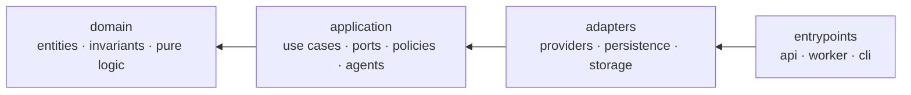
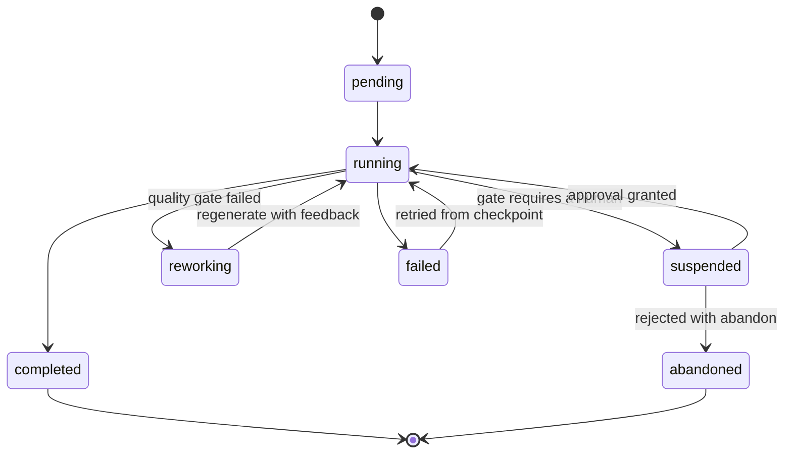
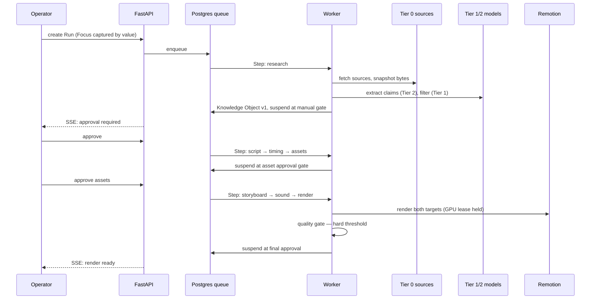

# Atlas — Architecture

**Status:** Phase 1 · **Date:** 2026-07-30
Behaviour is specified in `docs/SPEC.md`. Rationale lives in `docs/adr/`. This document defines structure.

---

## 1. Layering

Clean Architecture, four layers, dependencies pointing inward only.



| Layer | May import | Contains |
|---|---|---|
| `domain` | nothing from Atlas, no I/O library | Entities, value objects, invariants, pure computation |
| `application` | `domain` | Use cases, port interfaces, policies, agent orchestration |
| `adapters` | `application`, `domain` | Provider implementations, repositories, storage, renderer bridge |
| `entrypoints` | everything | FastAPI app, Dramatiq worker, Typer CLI |

**The rule that keeps this honest:** `domain/` may not import `sqlalchemy`, `httpx`, `pydantic-settings`,
or any vendor SDK. Enforced in CI by an import-linter contract, not by good intentions.

Two consequences worth stating because they are the point of the whole arrangement:

- **CLI parity is structural, not disciplined.** Both the API and the CLI are thin adapters over the same
  application use cases. A feature cannot exist in one and not the other without someone deliberately
  writing a second implementation. `prompt.md` demands total parity; this is how it is guaranteed.
- **Provider independence is enforced by import direction.** Nothing above `adapters/` can name a vendor.
  Swapping Gemini for something else touches one directory.

---

## 2. Folder layout

```
atlas/
├── prompt.md                     # founder's vision — immutable
├── CLAUDE.md                     # agent instructions
├── docs/
│   ├── SPEC.md  ARCHITECTURE.md  GLOSSARY.md  DECISIONS.md
│   └── adr/
├── apps/
│   ├── api/                      # FastAPI entrypoint — routes only
│   ├── worker/                   # Dramatiq entrypoint — task registration only
│   ├── cli/                      # Typer entrypoint — command surface only
│   ├── web/                      # React + TS dashboard
│   └── renderer/                 # Remotion project (Node) — compositions
├── packages/
│   ├── atlas/src/atlas/
│   │   ├── domain/
│   │   │   ├── knowledge/        # KnowledgeObject, Claim, Evidence, Source, Snapshot
│   │   │   ├── focus/            # Focus, Facet, Domain, Entity, ScopeMode
│   │   │   ├── script/           # Script, Beat, TimingPlan
│   │   │   ├── media/            # Asset, AssetLicense, Scene, Storyboard, RenderTarget
│   │   │   ├── quality/          # Rubric, QualityReport, NoveltyResult
│   │   │   └── execution/        # Run, Step, Gate, Approval, RejectionFeedback
│   │   ├── application/
│   │   │   ├── ports/            # every provider interface lives here
│   │   │   ├── usecases/         # one file per use case, called by API and CLI alike
│   │   │   ├── agents/           # research, extraction, verification, script, judge
│   │   │   └── policies/         # routing, license, gate, quota, novelty
│   │   ├── adapters/
│   │   │   ├── llm/              # gemini.py · ollama.py — the only vendor SDK imports
│   │   │   ├── search/  sources/  images/  audio/
│   │   │   ├── renderer/         # stub.py — the real renderer does not exist yet (D57)
│   │   │   ├── publish/  queue/
│   │   │   ├── persistence/      # SQLAlchemy models, repositories, Alembic
│   │   │   ├── storage/          # local filesystem, S3-compatible
│   │   │   ├── notify/           # logging_notifier.py
│   │   │   └── fakes/            # deterministic provider doubles used by every test (R2)
│   │   ├── platform/             # config, logging, clock, ids, errors, cache, quota ledger
│   │   └── prompts/              # versioned prompt templates — never inline strings
│   └── tokens/                   # design tokens shared by dashboard AND video
├── tests/                        # unit · integration · e2e · golden
├── deploy/                       # compose files, Caddyfile, VPS path (unprovisioned)
└── var/                          # local blobs, snapshots, renders — gitignored
```

`packages/tokens/` deserves a note: typography, palette, spacing, and motion constants live in one JSON
source consumed by both the React dashboard and the Remotion compositions. Choosing Remotion is what
makes this possible, and it means the dashboard and the videos cannot drift apart visually.

`platform/` is deliberately narrow — configuration, logging, clock, ID generation, typed errors, caching,
quota accounting. If something lands there that has business meaning, it belongs in `domain/` instead.

---

## 3. Orchestration

Postgres is the queue and the state store. Dramatiq workers execute Steps. See **ADR-0001**.



**Core tables:** `runs`, `steps`, `gates`, `approvals`, `model_calls`, `quota_ledger`,
`resource_locks`, `idempotency_keys`.

**Suspension is a row.** A Run waiting at a manual gate holds no process, no connection, no memory. It
can wait a week. Resumption reads the checkpoint and continues at the next Step. This is why a
human-in-the-loop pipeline does not need a workflow engine at this scale.

**Idempotency.** Every Step has a key of `(run_id, step_name, input_hash)`. A retried Step that already
produced output returns the stored output instead of re-executing. Combined with response caching, a
retry after a crash costs zero quota.

**Checkpointing.** Each Step writes its output artifact before marking itself succeeded. A Render failing
at 80% never re-runs research.

**The GPU semaphore.** One 8GB laptop GPU is shared by the local LLM, local image generation, and
Remotion's Chromium renderer. These cannot run concurrently without thrashing, so GPU work acquires a
named lease from `resource_locks` with a TTL and a priority, and the queue serializes it. Owning the
scheduler is what makes this expressible at all — a hosted queue would not know about the constraint.

**Rate limiting.** A token bucket per provider, persisted, shared across workers. Free-tier limits are
per-minute and per-day, so both windows are tracked, and a Step that cannot acquire a token is deferred
rather than failed.

---

## 4. One Run, end to end



Every arrow to a model is metered first. Every arrow to a source is snapshotted. Every artifact records
the versions that produced it.

---

## 5. Ports

Interfaces live in `application/ports/`. Sketches, not final signatures:

```python
class Llm(Protocol):
    @property
    def capabilities(self) -> LlmCapabilities: ...      # json mode, vision, context window, tools
    async def complete(self, request: LlmRequest) -> LlmResponse: ...

class StructuredLlm(Protocol):
    async def extract[T: BaseModel](
        self, request: LlmRequest, schema: type[T]
    ) -> Extracted[T]: ...                              # validate, one repair attempt, then fail loudly

class Renderer(Protocol):
    async def render(
        self, storyboard: Storyboard, timing: TimingPlan, target: RenderTarget
    ) -> RenderArtifact: ...

class SourceFetcher(Protocol):
    async def fetch(self, url: Url) -> Snapshot: ...    # polite, cached, hashed, timestamped
```

Every port has a deterministic fake in `packages/atlas/src/atlas/adapters/fakes/`. Every port is selected by configuration, never
by import. Capability negotiation is explicit because free-tier models differ in context window and
structured-output support, and the routing policy needs to know before dispatching.

**Provider categories:** `Llm`, `StructuredLlm`, `Embedder`, `Search`, `SourceFetcher`, `ImageSearch`,
`ImageGenerator`, `SoundLibrary`, `Renderer`, `Storage`, `Publisher`, `Notifier`, and `Speech` — the last
defined and unimplemented, so a future narrated format costs nothing today.

---

## 6. Persistence

- **Knowledge:** row-per-version with a `current` pointer. Claims, Evidence, and Sources are normalized
  tables with real foreign keys — the traceability chain must be enforced by the database, not by code.
  The exploratory parts of the Knowledge Object live in a JSONB payload with `schema_version` and
  upcast-on-read. See **ADR-0003**.
- **Vectors:** pgvector in the same Postgres. Semantic search is optional; bypass mode is the Phase 1
  default and the system must work fully with embeddings disabled.
- **Blobs:** content-addressed by SHA-256 at `var/blobs/sha256/ab/cd/<hash>`, with a `blobs` table
  holding metadata, size, media type, and reference count. Identical assets deduplicate automatically.
  Behind a `Storage` port, so moving to S3-compatible object storage is a config change.
- **Migrations:** Alembic, autogenerate reviewed by hand, never applied blindly.

---

## 7. Observability

`structlog` emitting JSON. A `trace_id` generated per Run and propagated through `contextvars` reaches
every log line, every model call, and every artifact.

Two tables carry the operational truth:

- `model_calls` — provider, model, prompt version, token counts, latency, cache hit, outcome. This is
  what the Agent Monitor renders, and what makes "why did this video cost 40 calls" answerable.
- `quota_ledger` — append-only consumption per provider per window, with reservations per Run.

OpenTelemetry tracing and an LLM-trace UI arrive in Phase 5, when agent count makes them worth the
weight. The ledger exists from the first model call, because it cannot be reconstructed after the fact.

---

## 8. Frontend

React 19 + TypeScript strict + Tailwind + shadcn/ui, dark-mode first. TanStack Query owns server state;
Zustand holds the small amount of genuine client state. SSE for live queue, Run, and log updates —
one-directional, proxy-transparent, no connection state to manage.

The **approval queue is the most important screen in the application**, because it is where the operator
spends their ten minutes per video. It is built as a keyboard-driven review surface: navigate Beats and
Assets without a mouse, approve or reject with structured feedback in a keystroke, see the Claim and its
Evidence beside the text it licenses. Not a list with buttons.

Sections follow `prompt.md`: Dashboard, Topics, Knowledge Database, Knowledge Graph, Research Queue,
Agent Monitor, Video Queue, Assets, Publishing, Analytics, Provider Settings, Approval Queue, Logs,
Configuration, Documentation.

---

## 9. Testing

| Level | Rule |
|---|---|
| Unit | No network, no database, no filesystem, no GPU. Pure domain logic and policies. |
| Integration | Real Postgres in a container. Real repositories. Fake providers. |
| End-to-end | Whole pipeline against `adapters/fakes/`. Must finish in under a minute, cost nothing, and run on every commit. |
| Cassettes | Real provider responses recorded once, replayed thereafter. Recording is manual and explicit. |
| Golden | The hand-scored quality set. Re-run on every prompt change to catch quality regressions. |

The fakes package is load-bearing infrastructure, not test scaffolding. If e2e tests need real providers,
they will quietly stop being run, and the pipeline will rot.

---

## 10. Deployment

**Development** — Docker Compose on the Arch box: Postgres with pgvector, API, worker, Vite dev server,
Caddy. Ollama runs on the host to reach the GPU directly.

**Production path** — the same Compose file plus a Caddy site block for automatic TLS, targeting a single
VPS. Written and documented, deliberately unprovisioned until requested. The Storage port and
content-addressed blobs mean the migration is a configuration change and a file sync, not a redesign.

**Configuration** — `.env` for secrets, YAML for structure (routing policy, style profiles, research
profiles, gate defaults), and runtime overrides in the database for anything the dashboard can toggle.
Nothing is hardcoded; every layer is documented in the deployment guide.

---

## 11. Divergence register — documented structure vs. actual code

**Added 2026-08-29** by the audit in `docs/AUDIT-2026-08-29.md`. Sections 1–10 above describe the
**intended** structure and remain the target. This section records, precisely, where the code on
disk does not match them. It exists because three phases of work were declared complete against the
description above without anyone checking the description against the tree.

**Rule going forward:** this table is verified and updated at the end of every working session that
touches structure. A row is deleted only when the code matches the doc — never when the doc is
quietly edited to match the code.

Verified against HEAD `9938244` on 2026-08-29. **Re-verified 2026-08-29 (Stage C review) against
HEAD `c776b59` plus the uncommitted Stage C working tree**; §11.5 updated (D72), every other row
still holds. `PipelineStage` has moved to `domain/execution/models.py` (defect G-06 closed, T-42),
which §11.1 never covered — no row changes.

**Re-verified again 2026-08-29 (Stage C remediation session, T-43 → T-45, T-51, T-52)** against
HEAD `c776b59` plus the working tree. Two rows changed, both about `packages/fakes/` (§11.1, §11.6):
the directory has been **deleted** (defect SC-13, task T-52), so the divergence is no longer "the
documented package is empty" but "the documented package does not exist, and §2/§5/§9 still name
it". §11.5's `model_calls` row is unchanged and still describes false provenance — that is T-12,
which this session did not reach. Every other row holds.

**Re-verified 2026-08-31 (this session)** against HEAD `c776b59` plus the working tree, after the
B1-B9 remediation. Rows closed: `packages/fakes/` naming (T-40), `adapters/sound/`,
`adapters/notify/`, the missing `publish/`/`queue/`/`search/` entries, the fakes-in-the-container
row in §11.2, the `model_calls` row in §11.5, the e2e path in §11.6, and the hardcoded story angle
in §11.7. Rows added: `production_repository.py`. The renderer row stays open by decision (D57).

### 11.1 Folder layout (§2)

| Documented | Actual | Note |
|---|---|---|
| `packages/fakes/` — "deterministic provider doubles used by every test" | **Deleted 2026-08-29 (T-52).** | **Closed 2026-08-31 (T-40).** §2's tree, §5 and §9 now name `adapters/fakes/`. |
| `adapters/embedding/` | Does not exist. `OllamaEmbedder` lives in `adapters/llm/ollama.py` | §2's tree no longer claims it. |
| `adapters/sound/` | Actual directory is `adapters/audio/` | **Closed 2026-08-31 (T-40).** §2 names `audio/`. |
| `adapters/notify/` | **Exists as of 2026-08-31.** Holds `LoggingNotifier`; the production container no longer wires a fake notifier. | Closed. |
| `adapters/llm/gemini/`, `adapters/llm/ollama/` (packages) | Single modules: `gemini.py`, `ollama.py` | **Closed 2026-08-31 (T-40).** §2 names the modules. |
| `adapters/renderer/remotion/` + `adapters/renderer/ffmpeg/` | One module `adapters/renderer/stub.py`; ffmpeg is invoked inline via `subprocess`. Renamed from `remotion.py` on 2026-08-31 (rule R3, defect C-03): it has never invoked Remotion. | **Still divergent from ADR-0005**, deliberately — the real renderer is deferred (D57). |
| — | `adapters/publish/`, `adapters/queue/`, `adapters/search/` exist and were **absent from §2** | **Closed 2026-08-31 (T-40).** |
| — | `adapters/persistence/repositories/production_repository.py` is new (ADR-0016) | Persists Scripts, Timing Plans, Storyboards and Render Artifacts. |
| `deploy/` — "compose files, Caddyfile, VPS path" | Does not exist. `docker-compose.yml` and `Caddyfile` sit at the repository root | |
| `domain/` subpackages: knowledge, focus, script, media, quality, execution | All present, **plus** undocumented `domain/assets/`, `domain/common/`, `domain/publishing/` | |
| — | `application/pipeline/` (holds `runner.py`, the orchestrator) is **absent from §2** | The single most important module in the application layer is undocumented. |

### 11.2 Enforcement claims (§1)

| Claim | Reality |
|---|---|
| "Enforced in CI by an import-linter contract, not by good intentions." | **False.** `import-linter` is not a dependency and no contract file exists. Enforcement is `tests/unit/test_layering_boundaries.py`, a hand-rolled AST check covering **`domain/` only** — the `adapters → application → domain` direction is not checked at all. See ADR-0014 for the decision to extend the AST test rather than adopt import-linter. |
| "Provider independence is enforced by import direction." | **Holds as of 2026-08-31** (defects C-01, C-02 closed). `adapters/container.py` imports nothing from `adapters/fakes/`; it wires `WikipediaSearch`, `HttpSourceFetcher` and `LoggingNotifier`. Guard 2 (`test_guard_2_no_fakes_imported_in_production_modules`) enforces it and no longer xfails. |

### 11.3 Persistence (§6)

| Claim | Reality |
|---|---|
| "a `blobs` table holding metadata, size, media type, and reference count" | **No `blobs` table exists.** 25 tables are defined in `adapters/persistence/tables.py`; none is `BlobTable`. Blobs are written to `var/blobs/sha256/…` by `LocalStorage` with no database row, so there is no reference count and no deduplication bookkeeping. |
| "Vectors: pgvector in the same Postgres" | **Not present.** No `pgvector` extension, no vector column, no import. Bypass mode is not merely the default — it is the only mode. |

### 11.4 Ports (§5)

| Claim | Reality |
|---|---|
| `StructuredLlm.extract` — "validate, one repair attempt, then fail loudly" | No repair attempt exists in either `GeminiLlm` or `OllamaLlm`. A malformed payload fails immediately. |
| "Every port is selected by configuration, never by import." | Ports are selected by **import**, in `Container.__init__`. There is no configuration surface for provider choice. |
| Port list: `Llm`, `StructuredLlm`, `Embedder`, `Search`, `SourceFetcher`, `ImageSearch`, `ImageGenerator`, `SoundLibrary`, `Renderer`, `Storage`, `Publisher`, `Notifier`, `Speech` | All present in `application/ports/`, plus an undocumented `QueueBroker` port (`ports/queue.py`) and `repositories.py`. |

### 11.5 Observability (§7)

| Claim | Reality |
|---|---|
| "A `trace_id` generated per Run and propagated through `contextvars` reaches every log line" | Partial. `structlog.contextvars.merge_contextvars` is configured in `platform/logging.py`, and `runs.trace_id` exists, but no code binds the trace ID into the context. Log lines do not carry it. |
| "`model_calls` — provider, model, prompt version, token counts, latency, cache hit, outcome" | **Correct as of 2026-08-31** (defect SC-02 closed, T-12). Provenance is taken from the adapter that executed: an `Extracted`/`LlmResponse` carries its own `provider` and `model_id`, and the agents record those. A run against fakes writes `provider='fake'`; the end-to-end test asserts it. |

### 11.6 Testing (§9)

| Claim | Reality |
|---|---|
| "Cassettes — real provider responses recorded once, replayed thereafter" | Does not exist. No cassette files, no recording mechanism, no library. |
| "Golden — the hand-scored quality set" | Does not exist. This is a prerequisite for ADR-0012's quality measurement. |
| "End-to-end … against `packages/fakes/`" | **Closed 2026-08-31 (T-40).** §9 now names `adapters/fakes/`. |
| Unit: "No network, no database, no filesystem" | `tests/unit/test_layering_boundaries.py` reads the filesystem by design. Acceptable, but the rule as written forbids it. |

### 11.7 Deployment (§10)

| Claim | Reality |
|---|---|
| "Configuration — `.env` for secrets, YAML for structure (routing policy, style profiles, research profiles, gate defaults)" | **No YAML configuration exists.** Routing policy is a Python dict (`policies/quota_policy.py`), gate defaults are a Python dict (`policies/gate_policy.py`), style and research profiles do not exist. |
| "Nothing is hardcoded" | Model IDs and the Ollama base URL are still hardcoded (ADR-0012 §3, §4; defects C-08, R-05). The story angle is **no longer** hardcoded: stage 8 calls `ScriptAgent.select_story_angle` instead of the literal `"Origins and Preservation"` (2026-08-31, ADR-0016). |
| "runtime overrides in the database for anything the dashboard can toggle" | Not implemented. The unused `policy_override` argument was removed from `GatePolicy.should_suspend` on 2026-08-31 (T-37). |
