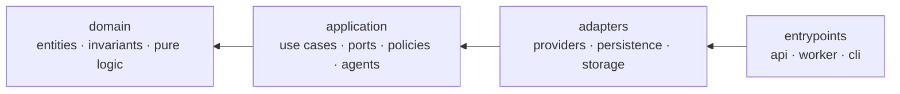
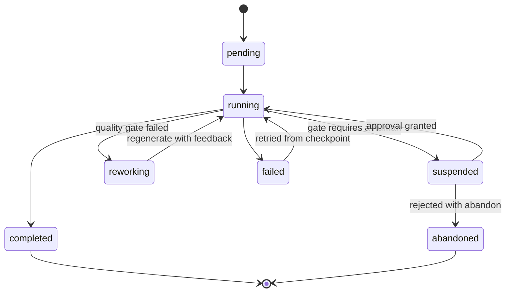
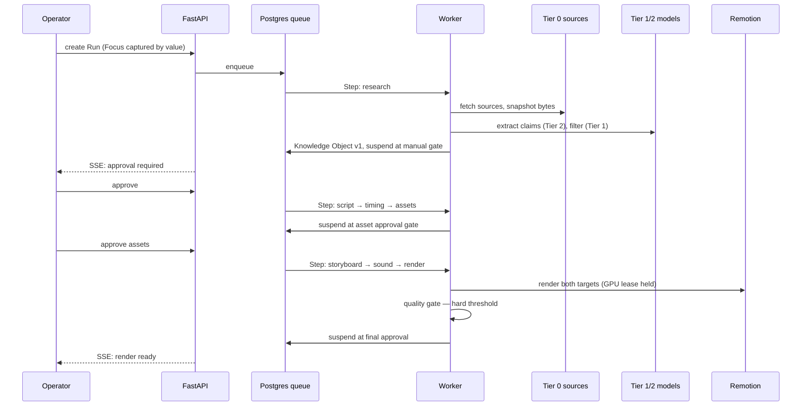

# Atlas — Architecture

**Status:** Phase 1 · **Date:** 2026-07-30
Behaviour is specified in `docs/SPEC.md`. Rationale lives in `docs/adr/`. This document defines structure.

---

## 1. Layering

Clean Architecture, four layers, dependencies pointing inward only.



| Layer | May import | Contains |
|---|---|---|
| `domain` | nothing from Atlas, no I/O library | Entities, value objects, invariants, pure computation |
| `application` | `domain` | Use cases, port interfaces, policies, agent orchestration |
| `adapters` | `application`, `domain` | Provider implementations, repositories, storage, renderer bridge |
| `entrypoints` | everything | FastAPI app, Dramatiq worker, Typer CLI |

**The rule that keeps this honest:** `domain/` may not import `sqlalchemy`, `httpx`, `pydantic-settings`,
or any vendor SDK. Enforced by `tests/unit/test_layering_boundaries.py`, a hand-rolled AST check that
runs in the suite and in the pre-commit hook — **not** by an import-linter contract; ADR-0014 chose
to extend the AST test rather than add the dependency. The check covers `domain/` only; the
`adapters → application` direction is not yet checked (open, `ARCHITECTURE.md` §11.2).

Two consequences worth stating because they are the point of the whole arrangement:

- **CLI parity is structural, not disciplined.** Both the API and the CLI are thin adapters over the same
  application use cases. A feature cannot exist in one and not the other without someone deliberately
  writing a second implementation. `prompt.md` demands total parity; this is how it is guaranteed.
- **Provider independence is enforced by import direction.** Nothing above `adapters/` can name a vendor.
  Swapping Gemini for something else touches one directory.

---

## 2. Folder layout

```
atlas/
├── prompt.md                     # founder's vision — immutable
├── CLAUDE.md                     # agent instructions
├── docs/
│   ├── SPEC.md  ARCHITECTURE.md  GLOSSARY.md  DECISIONS.md  STATUS.md
│   ├── AUDIT-2026-08-29.md       # defect register + task list — read after STATUS
│   ├── adr/                      # 0001-0016
│   ├── archive/                  # superseded documents, retained as evidence (R11)
│   └── diagrams/
├── apps/
│   ├── api/                      # FastAPI entrypoint — routes/, dependencies.py, schemas.py
│   ├── worker/                   # Dramatiq entrypoint — main.py, tasks.py
│   ├── cli/                      # Typer entrypoint — main.py, backup_restore.py
│   ├── web/                      # React + TS dashboard
│   └── renderer/                 # Remotion project (Node) — compositions, not yet invoked
├── packages/
│   ├── atlas/src/atlas/
│   │   ├── domain/
│   │   │   ├── knowledge/        # KnowledgeObjectVersion, Claim, Evidence, Source, Snapshot,
│   │   │   │                     #   invariants.py, payload.py, upcast.py
│   │   │   ├── focus/            # Focus, Facet, Domain, Entity, ScopeMode, FocusSnapshot
│   │   │   ├── script/           # Script, Beat, TimingPlan, BeatTiming, CaptionCue
│   │   │   ├── media/            # Scene, Storyboard, SoundTrack, SfxCue, RenderArtifact, RenderTarget
│   │   │   ├── assets/           # Asset, License, AssetApproval
│   │   │   ├── quality/          # RubricDimension, DimensionScore, QualityReport, NoveltyResult
│   │   │   ├── publishing/       # Channel, PublishingWindow, BlackoutRule, PublishSlot
│   │   │   ├── common/           # SourceTier and other cross-context enums
│   │   │   └── execution/        # Run, Step, Gate, Approval, RejectionFeedback, PipelineStage
│   │   ├── application/
│   │   │   ├── ports/            # every provider interface, plus repositories.py
│   │   │   ├── usecases/         # create_run, approve_gate, reject_gate, get_run_status
│   │   │   ├── agents/           # topic, research, extraction, verification, script,
│   │   │   │                     #   storyboard, sound_design, judge, scheduler, models.py
│   │   │   ├── pipeline/         # runner.py — the 18-stage orchestrator
│   │   │   └── policies/         # gate_policy, license_policy, quota_policy
│   │   ├── adapters/
│   │   │   ├── llm/              # gemini.py · ollama.py — the only vendor SDK imports
│   │   │   ├── search/           # wikipedia.py
│   │   │   ├── sources/          # fetcher.py
│   │   │   ├── images/           # wikimedia.py · archive_org.py · composite.py ·
│   │   │   │                     #   downloader.py · stub_generator.py
│   │   │   ├── audio/            # freesound.py · keystroke_sampler.py · compositor.py · speech.py
│   │   │   ├── renderer/         # stub.py — the real renderer does not exist yet (D57)
│   │   │   ├── publish/          # stub.py — no real publisher exists yet
│   │   │   ├── queue/            # dramatiq_broker.py
│   │   │   ├── notify/           # logging_notifier.py
│   │   │   ├── storage/          # local.py — content-addressed filesystem
│   │   │   ├── persistence/      # tables.py, repositories/, database.py, alembic/
│   │   │   ├── fakes/            # deterministic provider doubles — tests only (R2)
│   │   │   └── container.py      # the production DI container
│   │   ├── platform/             # config, logging, clock, ids, errors, cache, quota, redaction
│   │   └── prompts/              # versioned prompt templates — never inline strings
│   └── tokens/                   # design tokens shared by dashboard AND video
├── tests/                        # unit/ · integration/
├── docker-compose.yml  Caddyfile # deployment lives at the repository root, not in deploy/
└── var/                          # local blobs, snapshots, renders — gitignored
```

`packages/tokens/` deserves a note: typography, palette, spacing, and motion constants live in one JSON
source consumed by both the React dashboard and the Remotion compositions. Choosing Remotion is what
makes this possible, and it means the dashboard and the videos cannot drift apart visually.

`adapters/images/`, `adapters/publish/`, `adapters/queue/` and `adapters/renderer/` carry no
`__init__.py`; they are implicit namespace packages and import normally. Verified against the tree on
2026-08-31.

`platform/` is deliberately narrow — configuration, logging, clock, ID generation, typed errors, caching,
quota accounting. If something lands there that has business meaning, it belongs in `domain/` instead.

---

## 3. Orchestration

Postgres is the queue and the state store. Dramatiq workers execute Steps. See **ADR-0001**.



**Core tables:** `runs`, `steps`, `gates`, `approvals`, `model_calls`, `quota_ledger`,
`resource_locks`, `idempotency_keys`.

**Stage hand-off.** A Step writes the ID of what it produced into `steps.output_artifact_ref` before
marking itself succeeded, and later stages read that column to find the artifact. This is why a
resumed Run picks up the same Script the operator approved rather than generating a fresh one — see
**ADR-0016**, and `PipelineRunner._stage_output`.

**Suspension is a row.** A Run waiting at a manual gate holds no process, no connection, no memory. It
can wait a week. Resumption reads the checkpoint and continues at the next Step. This is why a
human-in-the-loop pipeline does not need a workflow engine at this scale.

**Idempotency.** Every Step has a key of `(run_id, step_name, input_hash)`. A retried Step that already
produced output returns the stored output instead of re-executing. Combined with response caching, a
retry after a crash costs zero quota.

**Checkpointing.** Each Step writes its output artifact before marking itself succeeded. A Render failing
at 80% never re-runs research.

**The GPU semaphore.** One 8GB laptop GPU is shared by the local LLM, local image generation, and
Remotion's Chromium renderer. These cannot run concurrently without thrashing, so GPU work acquires a
named lease from `resource_locks` with a TTL and a priority, and the queue serializes it. Owning the
scheduler is what makes this expressible at all — a hosted queue would not know about the constraint.

**Rate limiting.** A token bucket per provider, persisted, shared across workers. Free-tier limits are
per-minute and per-day, so both windows are tracked, and a Step that cannot acquire a token is deferred
rather than failed.

---

## 4. One Run, end to end



Every arrow to a model is metered first. Every arrow to a source is snapshotted. Every artifact records
the versions that produced it.

---

## 5. Ports

Interfaces live in `application/ports/`. Sketches, not final signatures:

```python
class Llm(Protocol):
    @property
    def capabilities(self) -> LlmCapabilities: ...      # json mode, vision, context window, tools
    async def complete(self, request: LlmRequest) -> LlmResponse: ...

class StructuredLlm(Protocol):
    async def extract[T: BaseModel](
        self, request: LlmRequest, schema: type[T]
    ) -> Extracted[T]: ...                              # validate, one repair attempt, then fail loudly

class Renderer(Protocol):
    async def render(
        self, storyboard: Storyboard, timing_plan: TimingPlan,
        target: RenderTarget, run_id: str,
    ) -> RenderArtifact: ...

class SourceFetcher(Protocol):
    async def fetch(self, url: Url) -> Snapshot: ...    # polite, cached, hashed, timestamped
```

Every port has a deterministic fake in `packages/atlas/src/atlas/adapters/fakes/`. Every port is selected by configuration, never
by import. Capability negotiation is explicit because free-tier models differ in context window and
structured-output support, and the routing policy needs to know before dispatching.

**Provider categories:** `Llm`, `StructuredLlm`, `Embedder`, `Search`, `SourceFetcher`, `ImageSearch`,
`ImageGenerator`, `SoundLibrary`, `Renderer`, `Storage`, `Publisher`, `Notifier`, `QueueBroker`, and
`Speech` — the last defined and unimplemented, so a future narrated format costs nothing today.

**Persistence ports** live beside them in `application/ports/repositories.py` and are not Providers:
`ExecutionRepositoryPort`, `KnowledgeRepositoryPort`, `FocusRepositoryPort`, `SourceRepositoryPort`,
`PublishingRepositoryPort`, and `ProductionRepositoryPort` (the per-Run Script, Timing Plan,
Storyboard and Render Artifacts — **ADR-0016**).

**Correction, 2026-08-31:** ports are selected by **import** in `Container.__init__`, not by
configuration. There is no configuration surface for provider choice; §11.4 keeps the row open.

---

## 6. Persistence

- **Knowledge:** row-per-version with a `current` pointer. Claims, Evidence, and Sources are normalized
  tables with real foreign keys — the traceability chain must be enforced by the database, not by code.
  The exploratory parts of the Knowledge Object live in a JSONB payload with `schema_version` and
  upcast-on-read. See **ADR-0003**.
- **Claims:** `claims` is an immutable identity row; every mutable field lives in append-only
  `claim_versions`, keyed `(claim_id, version)`, each carrying the actor and the reason. The current
  state of a Claim is its highest-numbered version. Nothing is updated in place. See **ADR-0015**.
- **Production artifacts:** `scripts`, `timing_plans`, `storyboards` and `render_artifacts`, one set
  per Run, owned by `ProductionRepository`. Ordered sub-structures — beats, beat timings, caption
  cues, scenes — are JSON columns on their owning row because they are always read and written whole
  through their parent. These artifacts are immutable rather than versioned: a rewrite is a new ID.
  See **ADR-0016**.
- **Vectors:** pgvector in the same Postgres. Semantic search is optional; bypass mode is the Phase 1
  default and the system must work fully with embeddings disabled.
- **Blobs:** content-addressed by SHA-256 at `var/blobs/sha256/ab/cd/<hash>`, behind a `Storage` port,
  so moving to S3-compatible object storage is a config change. **There is no `blobs` table** — the
  metadata, size, media-type and reference-count row this section promised has never been built, so
  there is no deduplication bookkeeping and no way to know whether a blob is still referenced. Open;
  §11.3 carries the row (defect A-03).
- **Migrations:** Alembic, autogenerate reviewed by hand, never applied blindly.

---

## 7. Observability

`structlog` emitting JSON. A `trace_id` is generated per Run and stored on `runs.trace_id`. The
intent is that it propagates through `contextvars` to every log line, every model call, and every
artifact — **that binding is not implemented**; `structlog.contextvars.merge_contextvars` is
configured but nothing binds the ID into the context, so log lines do not carry it. Open, §11.5.

Two tables carry the operational truth:

- `model_calls` — provider, model, prompt version, token counts, latency, cache hit, outcome. This is
  what the Agent Monitor renders, and what makes "why did this video cost 40 calls" answerable. The
  provider and model ID are taken from the adapter that executed — an `LlmResponse` / `Extracted`
  carries its own — never from the routing table, so a row cannot claim a model that did not run.
- `quota_ledger` — append-only consumption per provider per window, with reservations per Run.

OpenTelemetry tracing and an LLM-trace UI arrive in Phase 5, when agent count makes them worth the
weight. The ledger exists from the first model call, because it cannot be reconstructed after the fact.

---

## 8. Frontend

React 19 + TypeScript strict + Tailwind + shadcn/ui, dark-mode first. TanStack Query owns server state;
Zustand holds the small amount of genuine client state. SSE for live queue, Run, and log updates —
one-directional, proxy-transparent, no connection state to manage.

The **approval queue is the most important screen in the application**, because it is where the operator
spends their ten minutes per video. It is built as a keyboard-driven review surface: navigate Beats and
Assets without a mouse, approve or reject with structured feedback in a keystroke, see the Claim and its
Evidence beside the text it licenses. Not a list with buttons.

Sections follow `prompt.md`: Dashboard, Topics, Knowledge Database, Knowledge Graph, Research Queue,
Agent Monitor, Video Queue, Assets, Publishing, Analytics, Provider Settings, Approval Queue, Logs,
Configuration, Documentation.

---

## 9. Testing

| Level | Rule |
|---|---|
| Unit | No network, no database, no filesystem, no GPU. Pure domain logic and policies. |
| Integration | Real Postgres in a container. Real repositories. Fake providers. |
| End-to-end | Whole pipeline against `adapters/fakes/`. Must finish in under a minute, cost nothing, and run on every commit. |
| Cassettes | Real provider responses recorded once, replayed thereafter. Recording is manual and explicit. |
| Golden | The hand-scored quality set. Re-run on every prompt change to catch quality regressions. |

The fakes package is load-bearing infrastructure, not test scaffolding. If e2e tests need real providers,
they will quietly stop being run, and the pipeline will rot.

---

## 10. Deployment

**Development** — Docker Compose on the Arch box: Postgres with pgvector, API, worker, Vite dev server,
Caddy. Ollama runs on the host to reach the GPU directly.

**Production path** — the same Compose file plus a Caddy site block for automatic TLS, targeting a single
VPS. Written and documented, deliberately unprovisioned until requested. The Storage port and
content-addressed blobs mean the migration is a configuration change and a file sync, not a redesign.

**Configuration** — `.env` for secrets, YAML for structure (routing policy, style profiles, research
profiles, gate defaults), and runtime overrides in the database for anything the dashboard can toggle.
Nothing is hardcoded; every layer is documented in the deployment guide.

---

## 11. Divergence register — documented structure vs. actual code

**Added 2026-08-29** by the audit in `docs/AUDIT-2026-08-29.md`. Sections 1–10 above describe the
**intended** structure. This section records, precisely, where the code on disk does not match them.
It exists because three phases of work were declared complete against the description above without
anyone checking the description against the tree.

**Rule going forward:** this table is verified and updated at the end of every working session that
touches structure. A row is deleted only when the code matches the doc — never when the doc is
quietly edited to match the code. When a row is closed, the session says **which side it changed**.

### Verification history

| Date | Against | Outcome |
|---|---|---|
| 2026-08-29 | HEAD `9938244` | Register created, A-01 → A-08. |
| 2026-08-29 (Stage C review) | `c776b59` + working tree | §11.5 updated (D72); `PipelineStage` moved to `domain/execution/` (G-06, T-42). |
| 2026-08-29 (Stage C remediation) | `c776b59` + working tree | `packages/fakes/` deleted (SC-13, T-52); §11.1 and §11.6 rows rewritten. |
| **2026-08-31 (verification session + documentation pass)** | **`714cade` and later, clean tree** | **§11.1 closed in full (T-40); §11.2, §11.5, §11.6 closed; §11.3, §11.4, §11.7 partially closed. Sections 1–10 above were rewritten to the real tree.** Five rows remain open, all listed below with the reason each is open by decision rather than by oversight. |

### 11.1 Folder layout (§2) — **CLOSED 2026-08-31 (T-40)**

Every row is resolved. §2's tree was rewritten from `find packages apps -type f` output, so it is
now a transcription of the tree rather than a description of an intention. **Side changed: the doc**,
except where noted.

| Was documented | Was actual | Resolution |
|---|---|---|
| `packages/fakes/` | Deleted 2026-08-29 (SC-13, T-52) | §2, §5 and §9 now name `adapters/fakes/`. Doc changed. |
| `adapters/embedding/` | Never existed; `OllamaEmbedder` lives in `adapters/llm/ollama.py` | §2 no longer claims it. Doc changed. |
| `adapters/sound/` | Actual directory is `adapters/audio/` | §2 names `audio/`. Doc changed. |
| `adapters/notify/` "does not exist; `FakeNotifier` is the only `Notifier`" | — | **Code changed.** `adapters/notify/logging_notifier.py` now exists and the production container wires `LoggingNotifier` (D97). |
| `adapters/llm/gemini/`, `adapters/llm/ollama/` as packages | Single modules | §2 names the modules. Doc changed. |
| `adapters/renderer/remotion/` + `adapters/renderer/ffmpeg/` | One module | **Both sides changed.** The module is now `adapters/renderer/stub.py` (rule R3, D96) and §2 says so. The real renderer stays deferred (D57); ADR-0005 still describes the target. |
| `adapters/publish/`, `adapters/queue/`, `adapters/search/` absent from §2 | They exist | §2 lists them. Doc changed. |
| `application/pipeline/` absent from §2 (**A-08**) | It holds `runner.py` | §2 lists it. Doc changed. |
| `domain/assets/`, `domain/common/`, `domain/publishing/` absent from §2 | They exist | §2 lists them. Doc changed. |
| `deploy/` — "compose files, Caddyfile, VPS path" | `docker-compose.yml` and `Caddyfile` sit at the repository root | §2 says so. Doc changed. |
| — | `adapters/persistence/repositories/production_repository.py` is new | §2 and §6 describe it (ADR-0016). Doc changed. |

### 11.2 Enforcement claims (§1) — **CLOSED 2026-08-31**

| Claim | Resolution |
|---|---|
| "Enforced in CI by an import-linter contract" (**A-01**) | **Doc changed.** §1 now says what actually enforces it: `tests/unit/test_layering_boundaries.py`, an AST check, per ADR-0014 — and states plainly that it covers `domain/` only. The uncovered `adapters → application` direction is carried forward as an open item in §11.8. |
| "Provider independence is enforced by import direction" (**C-01**, **C-02**) | **Code changed.** `adapters/container.py` imports nothing from `adapters/fakes/`; it wires `WikipediaSearch`, `HttpSourceFetcher` and `LoggingNotifier` (D97). Guard 2 enforces it and no longer `xfail`s. |

### 11.3 Persistence (§6) — partially closed

| Claim | Reality |
|---|---|
| "a `blobs` table holding metadata, size, media type, and reference count" (**A-03**) | **Still false, now stated as false in §6 rather than promised.** 30 tables are defined in `adapters/persistence/tables.py`; none is `BlobTable`. Blobs are written to `var/blobs/sha256/…` with no database row, so there is no reference count and no dedup bookkeeping. **Open — doc changed to tell the truth; the code fix is unbuilt.** |
| "Vectors: pgvector in the same Postgres" | **Still false.** No extension, no vector column, no import. Bypass mode is not the default — it is the only mode. Open. |
| Claim state | **Closed 2026-08-31.** §6 documents the `claims` / `claim_versions` split (ADR-0015). Code and doc changed together. |
| Production artifacts | **Closed 2026-08-31.** §6 documents `scripts`, `timing_plans`, `storyboards`, `render_artifacts` (ADR-0016). Code and doc changed together. |

### 11.4 Ports (§5) — partially closed

| Claim | Reality |
|---|---|
| `StructuredLlm.extract` — "validate, one repair attempt, then fail loudly" | **Still false.** No repair attempt exists in `GeminiLlm` or `OllamaLlm`; a malformed payload fails immediately. Open — the sketch in §5 is aspirational and is marked as a sketch. |
| "Every port is selected by configuration, never by import." | **Still false.** Ports are selected by import in `Container.__init__`; there is no configuration surface for provider choice. §5 now carries an explicit correction saying so. Doc changed; the code fix is part of **T-29**. |
| Port list completeness | **Closed 2026-08-31.** §5 now lists `QueueBroker` and the six persistence ports, including `ProductionRepositoryPort`. Doc changed. |

### 11.5 Observability (§7) — closed as a doc matter, one item open in code

| Claim | Reality |
|---|---|
| "A `trace_id` … propagated through `contextvars` reaches every log line" | **Still not implemented.** `runs.trace_id` exists and `merge_contextvars` is configured, but nothing binds the ID. §7 now states this rather than promising it. **Doc changed; code fix open.** |
| "`model_calls` — provider, model, …" (**SC-02**, T-12) | **Closed.** Provenance is taken from the adapter that executed. A run against fakes writes `provider='fake'`; the end-to-end test asserts it. Code changed. |

### 11.6 Testing (§9) — partially closed

| Claim | Reality |
|---|---|
| "End-to-end … against `packages/fakes/`" | **Closed 2026-08-31 (T-40).** §9 names `adapters/fakes/`. Doc changed. |
| "Cassettes — real provider responses recorded once, replayed thereafter" | **Still does not exist.** No cassette files, no recording mechanism, no library. Open. |
| "Golden — the hand-scored quality set" | **Still does not exist.** Prerequisite for ADR-0012's quality measurement. Open — **T-36**. |
| Unit: "No network, no database, no filesystem" | `tests/unit/test_layering_boundaries.py` and `test_no_fabrication.py` read the filesystem by design — they are AST guards over the source tree. Accepted; the rule as written forbids it. **Doc changed:** §9's Unit row should be read as "no network, no database, no GPU"; source-tree reads by static guards are exempt. |

### 11.7 Deployment (§10) — partially closed

| Claim | Reality |
|---|---|
| "Configuration — `.env` for secrets, YAML for structure" | **Still false.** No YAML configuration exists. Routing policy is a Python dict (`policies/quota_policy.py`), gate defaults are a Python dict (`policies/gate_policy.py`), style and research profiles do not exist. Open — **T-29**. |
| "Nothing is hardcoded" | **Partially false.** Model IDs (`gemini-2.0-flash`, six sites) and the Ollama base URL are hardcoded — **T-29**, defects C-08, R-05. The story angle is no longer hardcoded (D92). |
| "runtime overrides in the database for anything the dashboard can toggle" | **Still not implemented.** The unused `policy_override` argument was removed from `GatePolicy.should_suspend` on 2026-08-31 (T-37), so the doc no longer has a phantom implementation to point at. Open. |

### 11.7b Structure changed by the second verification on 2026-08-31

Recorded here because §11 is the register of where the document and the tree disagreed. Full
findings in `docs/AUDIT-2026-08-29.md` §15.

| Item | Which side changed | Note |
|---|---|---|
| `Dockerfile` | **Tree.** `docker-compose.yml` had named it since it was written and it did not exist, so `docker compose up` failed on the first build. It installs ffmpeg, the one system dependency `StubRenderer` has. | V-05, D116 |
| `application/usecases/inspect_run.py` | **Tree.** Two read-only use cases and their view models, behind `GET /runs/{id}/knowledge` and `GET /runs/{id}/telemetry`. | V-03, D111 |
| `apps/web/src/api/{client,types}.ts` | **Tree.** Rewritten against the real API. The previous types described endpoints and fields that have never existed, and the client answered failures with fabricated data. | V-03 |
| `apps/renderer/src/**/*.js` | **Tree.** Eleven committed `tsc` outputs removed; the package's tsconfig sets `noEmit` and its `main` points at source. | V-09 |
| `ports/embedder.py` | **Tree.** The port gained `provider` and `model_id`, so a metered embedding names the adapter that ran (Invariant 7). | V-02, D110 |
| `platform/quota.py` | **Tree.** In-memory counters and their lock deleted; both windows are computed from `quota_ledger`, which is what ADR-0004 always said. | V-04, D115 |
| `apps/worker/main.py` | **Tree.** The poll loop that polled nothing is deleted. | V-08, D118 |

### 11.8 Open structural items carried forward

Everything above that is still open, in one list, so the next session does not have to re-derive it:

| Item | Task | Why it is still open |
|---|---|---|
| No `blobs` table; no refcount, no dedup | **T-40** residue / new | Needs a migration and an ADR; nothing depends on it yet. |
| No `pgvector`, no vector column | Phase 6 (SPEC §15) | The knowledge graph is unbuilt; embeddings have no consumer. |
| `adapters → application` import direction unchecked | ADR-0014 follow-up | The AST guard covers `domain/` only. |
| No structured-output repair attempt | — | Both LLM adapters fail immediately on malformed JSON. |
| Providers selected by import, not configuration | **T-29** | Needs the settings surface T-29 introduces. |
| `trace_id` never bound into the logging context | — | One `structlog.contextvars.bind_contextvars` call at run start; nobody has made it. |
| No cassettes, no golden set | **T-36** | Blocks ADR-0012's quality measurement. |
| Model IDs hardcoded | **T-29** | ADR-0012 records the decision; the implementation is unstarted. The Ollama base URL left this row on 2026-08-31 — it is `Settings.ollama_base_url` (**D116**). |
| No YAML configuration surface | **T-29** | Same. |
| No browser test for `apps/web` | new, 2026-08-31 | Guard 8 parses the dashboard's sources for fixtures; nothing renders it and asserts what appears. This is the gap that let defect **V-03** stand for a whole phase. |
| No cassette for any network adapter | **T-36** | Seven wired adapters reach the network and none has a test, because a unit test may not and there is nothing to replay. `tests/integration/test_production_adapters.py` covers the six that do not. |
| Gate review data has no endpoint | **D111** | The approval screen can show Gate rows and link to the Run's Knowledge Object and telemetry. Asset candidates, script beats and the quality report have no read model, so those panels were deleted rather than kept as fixtures. |
