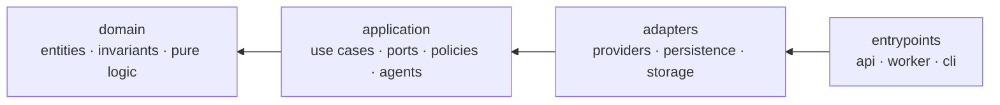
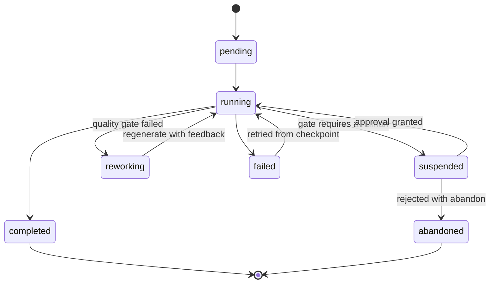
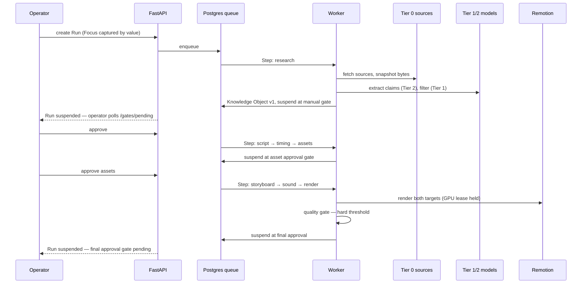

# Atlas — Architecture

**Status:** Phase 1 · **Date:** 2026-07-30
Behaviour is specified in `docs/SPEC.md`. Rationale lives in `docs/adr/`. This document defines structure.

---

## 1. Layering

Clean Architecture, four layers, dependencies pointing inward only.



| Layer | May import | Contains |
|---|---|---|
| `domain` | nothing from Atlas, no I/O library | Entities, value objects, invariants, pure computation |
| `application` | `domain` | Use cases, port interfaces, policies, agent orchestration |
| `adapters` | `application`, `domain` | Provider implementations, repositories, storage, renderer bridge |
| `entrypoints` | everything | FastAPI app, Dramatiq worker, Typer CLI |

**The rule that keeps this honest:** `domain/` may not import `sqlalchemy`, `httpx`, `pydantic-settings`,
or any vendor SDK. Enforced by `tests/unit/test_layering_boundaries.py`, a hand-rolled AST check that
runs in the suite and in the pre-commit hook — **not** by an import-linter contract; ADR-0014 chose
to extend the AST test rather than add the dependency. The check covers `domain/` only; the
`adapters → application` direction is not yet checked (open, `ARCHITECTURE.md` §11.2).

Two consequences worth stating because they are the point of the whole arrangement:

- **CLI parity is structural, not disciplined.** Both the API and the CLI are thin adapters over the same
  application use cases. A feature cannot exist in one and not the other without someone deliberately
  writing a second implementation. `prompt.md` demands total parity; this is how it is guaranteed.
- **Provider independence is enforced by import direction.** Nothing above `adapters/` can name a vendor.
  Swapping Gemini for something else touches one directory.

---

## 2. Folder layout

```
atlas/
├── prompt.md                     # founder's vision — immutable
├── CLAUDE.md                     # agent instructions
├── docs/
│   ├── SPEC.md  ARCHITECTURE.md  GLOSSARY.md  DECISIONS.md  STATUS.md
│   ├── AUDIT-2026-08-29.md       # defect register + task list — read after STATUS
│   ├── adr/                      # 0001-0018 (0010 is void — see 0011)
│   ├── archive/                  # superseded documents, retained as evidence (R11)
│   └── diagrams/
├── apps/
│   ├── api/                      # FastAPI entrypoint — routes/, dependencies.py, schemas.py
│   ├── worker/                   # Dramatiq entrypoint — main.py, tasks.py
│   ├── cli/                      # Typer entrypoint — main.py, backup_restore.py
│   ├── web/                      # React + TS dashboard
│   └── renderer/                 # Remotion project (Node) — compositions exist, nothing invokes them
├── packages/
│   ├── atlas/src/atlas/
│   │   ├── domain/
│   │   │   ├── knowledge/        # KnowledgeObjectVersion, Claim, Evidence, Source, Snapshot,
│   │   │   │                     #   invariants.py, payload.py, upcast.py
│   │   │   ├── focus/            # Focus, Facet, Domain, Entity, ScopeMode, FocusSnapshot
│   │   │   ├── script/           # Script, Beat, TimingPlan, BeatTiming, CaptionCue
│   │   │   ├── media/            # Scene, Storyboard, SoundTrack, SfxCue, RenderArtifact, RenderTarget
│   │   │   ├── assets/           # Asset, License, AssetApproval
│   │   │   ├── quality/          # RubricDimension, DimensionScore, QualityReport, NoveltyResult
│   │   │   ├── publishing/       # Channel, PublishingWindow, BlackoutRule, PublishSlot
│   │   │   ├── common/           # SourceTier and other cross-context enums
│   │   │   └── execution/        # Run, Step, Gate, Approval, RejectionFeedback, PipelineStage
│   │   ├── application/
│   │   │   ├── ports/            # every provider interface, plus repositories.py
│   │   │   ├── usecases/         # create_run, approve_gate, reject_gate, get_run_status,
│   │   │   │                     #   inspect_run (knowledge + telemetry read models)
│   │   │   ├── agents/           # topic, research, extraction, verification, script,
│   │   │   │                     #   storyboard, sound_design, judge, scheduler, models.py
│   │   │   ├── pipeline/         # runner.py — the 18-stage orchestrator
│   │   │   └── policies/         # gate_policy, license_policy, quota_policy
│   │   ├── adapters/
│   │   │   ├── llm/              # gemini.py · ollama.py — the only vendor SDK imports
│   │   │   ├── search/           # wikipedia.py
│   │   │   ├── sources/          # fetcher.py
│   │   │   ├── images/           # wikimedia.py · archive_org.py · composite.py ·
│   │   │   │                     #   downloader.py · stub_generator.py
│   │   │   ├── audio/            # freesound.py · keystroke_sampler.py · compositor.py · speech.py
│   │   │   ├── renderer/         # stub.py — the real renderer does not exist yet (D57)
│   │   │   ├── publish/          # stub.py — no real publisher exists yet
│   │   │   ├── queue/            # dramatiq_broker.py
│   │   │   ├── notify/           # logging_notifier.py
│   │   │   ├── storage/          # local.py — content-addressed filesystem
│   │   │   ├── persistence/      # tables.py, repositories/, database.py, alembic/
│   │   │   ├── fakes/            # deterministic provider doubles — tests only (R2)
│   │   │   └── container.py      # the production DI container
│   │   ├── platform/             # config, logging, clock, ids, errors, cache, quota, redaction
│   │   └── prompts/              # versioned prompt templates — never inline strings
│   └── tokens/                   # design tokens shared by dashboard AND video
├── tests/                        # unit/ · integration/
├── Dockerfile                    # api + worker image; installs ffmpeg for StubRenderer
├── docker-compose.yml  Caddyfile # deployment lives at the repository root, not in deploy/
└── var/                          # local blobs, snapshots, renders — gitignored
```

`packages/tokens/` deserves a note: typography, palette, spacing, and motion constants live in one JSON
source consumed by both the React dashboard and the Remotion compositions. Choosing Remotion is what
makes this possible, and it means the dashboard and the videos cannot drift apart visually.

`adapters/images/`, `adapters/publish/`, `adapters/queue/` and `adapters/renderer/` carry no
`__init__.py`; they are implicit namespace packages and import normally. Verified against the tree on
2026-08-31.

`apps/api/routes/` holds `health.py`, `runs.py`, `gates.py` and `quota.py`. There is no `events.py`:
the SSE route it defined answered any run ID with two hardcoded messages and had no consumer, so it
was deleted rather than labelled (ADR-0017 §5, defect **V-12**). The dashboard polls every five
seconds through react-query.

`platform/` is deliberately narrow — configuration, logging, clock, ID generation, typed errors, caching,
quota accounting. If something lands there that has business meaning, it belongs in `domain/` instead.

---

## 2.1 The HTTP surface

Transcribed from `app.openapi()` on 2026-09-05 — **15 paths, 20 operations**. **This table is the contract the dashboard codes
against.** It exists because no document previously stated the API surface, and the dashboard
consequently invented one: its wire types declared `RunItem.current_stage`, `GateItem.stage`,
`GateItem.metadata` and a gate status of `'open'`, none of which exist, and it called `/gates`, which
is not a route (defect **V-03**). If you change a route, change this table in the same commit.

| Method | Path | Request | Response | Auth |
|---|---|---|---|---|
| `GET` | `/health` | — | `{status, database, service, timestamp}` | none |
| `POST` | `/runs` | `CreateRunRequest` — `topic_id` **required**, `channel_id`, `actor_id`, `focus_id?` | `RunResponse` · 201 | `verify_api_key` |
| `GET` | `/runs` | `?limit=1..200` | `list[RunResponse]` | `verify_api_key` |
| `GET` | `/runs/{run_id}` | — | `RunResponse` | `verify_api_key` |
| `GET` | `/runs/{run_id}/steps` | — | `list[StepResponse]` | none |
| `GET` | `/runs/{run_id}/gates` | — | `list[GateResponse]` | none |
| `GET` | `/runs/{run_id}/knowledge` | — | `RunKnowledgeView` — the Run's current Knowledge Object with every Claim resolved to Evidence, Source and Snapshot | `verify_api_key` |
| `GET` | `/runs/{run_id}/telemetry` | `?limit=1..500` | `list[TelemetryEvent]` — Steps and metered model calls merged, newest first | `verify_api_key` |
| `GET` | `/gates/pending` | — | `list[GateResponse]` | `verify_api_key` |
| `POST` | `/gates/{gate_id}/approve` | `ApproveGateRequest` — `actor_id` | `ApprovalResponse`; resumes the Run | `verify_api_key` |
| `POST` | `/gates/{gate_id}/reject` | `RejectGateRequest` — `target_ref`, `rubric_dimension`, `reason`, `action`, `actor_id`, all required (SPEC §7) | `ApprovalResponse` | `verify_api_key` |
| `GET` | `/quota` | — | `QuotaStatusResponse` — per provider, computed from `quota_ledger` | `verify_api_key` |
| `GET` | `/domains` | — | `list[DomainResponse]` — by ID, Research Profile included | `verify_api_key` |
| `POST` | `/domains` | `CreateDomainRequest` — `id`, `name`, `description` | `DomainResponse` · 201; **409** if the ID exists | `verify_api_key` |
| `GET` | `/topics` | — | `list[TopicResponse]` — newest first | `verify_api_key` |
| `POST` | `/topics` | `CreateTopicRequest` — `id`, `title`, `domain_id`, `entity_id?` | `TopicResponse` · 201; **404** unknown Domain, **409** duplicate ID | `verify_api_key` |
| `GET` | `/channels` | — | `list[ChannelResponse]` — by ID, Style Profile included | `verify_api_key` |
| `POST` | `/channels` | `CreateChannelRequest` — `id`, `name`, `audience_timezone`, `style_profile` | `ChannelResponse` · 201; **409** if the ID exists | `verify_api_key` |
| `GET` | `/focuses` | — | `list[FocusListing]` — newest first, each flagged `is_active` | `verify_api_key` |
| `POST` | `/focuses` | `CreateFocusRequest` — `name`, `facets`, `scope_mode`, `entity_id?`, `actor_id`; **no `id`** | `FocusListing` · 201; does **not** become the Active Focus | `verify_api_key` |

Response models live in `apps/api/schemas.py`, except `RunKnowledgeView`, `TelemetryEvent` and
`FocusListing`, which are the application-layer view models returned by
`application/usecases/inspect_run.py` and `application/usecases/list_run_prerequisites.py` and are
used directly as `response_model` rather than re-declared — one shape, not two.

**The nine rows below `/quota` were added on 2026-09-05 (T-64).** Before them the dashboard could not
name a single Topic, Channel or Focus, so its Launch form was three free-text boxes over IDs only the
terminal could reveal. `POST /focuses` takes no `id` because a Focus is immutable and versioned by
creation; the other three take one because an operator names them.

Two things this table records honestly:

- **`verify_api_key` is a no-op unless `ATLAS_API_AUTH_ENABLED=true`.** It returns `"anonymous"` when
  auth is disabled, which is the default. The "Auth" column names the dependency, not a guarantee.
- **`/runs/{run_id}/steps` and `/runs/{run_id}/gates` have no auth dependency at all**, unlike every
  neighbour. That is an inconsistency, not a decision — task **T-57**.

---

## 3. Orchestration

Postgres is the queue and the state store. Dramatiq workers execute Steps. See **ADR-0001**.



**Core tables:** `runs`, `steps`, `gates`, `approvals`, `model_calls`, `quota_ledger`,
`resource_locks`, `idempotency_keys`.

**Stage hand-off.** A Step writes the ID of what it produced into `steps.output_artifact_ref` before
marking itself succeeded, and later stages read that column to find the artifact. This is why a
resumed Run picks up the same Script the operator approved rather than generating a fresh one — see
**ADR-0016**, and `PipelineRunner._stage_output`.

**Suspension is a row.** A Run waiting at a manual gate holds no process, no connection, no memory. It
can wait a week. Resumption reads the checkpoint and continues at the next Step. This is why a
human-in-the-loop pipeline does not need a workflow engine at this scale.

**Idempotency.** Every Step has a key of `(run_id, step_name, input_hash)`. A retried Step that already
produced output returns the stored output instead of re-executing. Combined with response caching, a
retry after a crash costs zero quota.

**Checkpointing.** Each Step writes its output artifact before marking itself succeeded. A Render failing
at 80% never re-runs research.

**The GPU semaphore.** One 8GB laptop GPU is shared by the local LLM, local image generation, and
Remotion's Chromium renderer. These cannot run concurrently without thrashing, so GPU work acquires a
named lease from `resource_locks` with a TTL and a priority, and the queue serializes it. Owning the
scheduler is what makes this expressible at all — a hosted queue would not know about the constraint.

**Rate limiting.** Both windows — per-minute and per-day — are computed from `quota_ledger` on every
check, so the budget is shared across the API, the worker and every CLI invocation. This is stated as
implementation, not aspiration, because until 2026-08-31 it was aspiration: the counters lived in
process memory and the ledger was written and never read, which handed each new process a full daily
budget on a tier that allows twenty requests (defect **V-04**, D115).

One thing this paragraph has always over-promised and still does: a Step that cannot acquire budget is
**failed**, not deferred. `check_rate_limits` raises `RateLimitExceededError` or `QuotaExceededError`
and `_execute_stage` marks the Step and the Run failed. Deferral needs a scheduler that can re-queue on
a window boundary; nobody has built it. ADR-0004 §"Degradation" describes suspend-and-notify as the
intent — task **T-29** owns closing the gap.

---

## 4. One Run, end to end



Every arrow to a model is metered first — enforced by Guard 9 and by `check_rate_limits` reading
`quota_ledger`, not by convention (ADR-0017, defect V-02). Every arrow to a source is snapshotted.
Every artifact records the versions that produced it.

The two dashed arrows are the operator learning that a Run has suspended. They are drawn as pushes
because that is the intent; today they are a 5-second poll of `/gates/pending`, and no server push
exists (**T-56**).

---

## 5. Ports

Interfaces live in `application/ports/`. Sketches, not final signatures:

```python
class Llm(Protocol):
    @property
    def capabilities(self) -> LlmCapabilities: ...      # json mode, vision, context window, tools
    async def complete(self, request: LlmRequest) -> LlmResponse: ...

class StructuredLlm(Protocol):
    async def extract[T: BaseModel](
        self, request: LlmRequest, schema: type[T]
    ) -> Extracted[T]: ...                              # validate, one repair attempt, then fail loudly

class Renderer(Protocol):
    async def render(
        self, storyboard: Storyboard, timing_plan: TimingPlan,
        target: RenderTarget, run_id: str,
    ) -> RenderArtifact: ...

class SourceFetcher(Protocol):
    async def fetch(self, url: Url) -> Snapshot: ...    # polite, cached, hashed, timestamped
```

Every port has a deterministic fake in `packages/atlas/src/atlas/adapters/fakes/`. Every port is selected by configuration, never
by import. Capability negotiation is explicit because free-tier models differ in context window and
structured-output support, and the routing policy needs to know before dispatching.

**Provider categories:** `Llm`, `StructuredLlm`, `Embedder`, `Search`, `SourceFetcher`, `ImageSearch`,
`ImageGenerator`, `SoundLibrary`, `Renderer`, `Storage`, `Publisher`, `Notifier`, `QueueBroker`, and
`Speech` — the last defined and unimplemented, so a future narrated format costs nothing today.

**Persistence ports** live beside them in `application/ports/repositories.py` and are not Providers:
`ExecutionRepositoryPort`, `KnowledgeRepositoryPort`, `FocusRepositoryPort`, `SourceRepositoryPort`,
`PublishingRepositoryPort`, and `ProductionRepositoryPort` (the per-Run Script, Timing Plan,
Storyboard and Render Artifacts — **ADR-0016**).

**Correction, 2026-08-31:** ports are selected by **import** in `Container.__init__`, not by
configuration. There is no configuration surface for provider choice; §11.4 keeps the row open.

---

## 6. Persistence

- **Knowledge:** row-per-version with a `current` pointer. Claims, Evidence, and Sources are normalized
  tables with real foreign keys — the traceability chain must be enforced by the database, not by code.
  The exploratory parts of the Knowledge Object live in a JSONB payload with `schema_version` and
  upcast-on-read. See **ADR-0003**.
- **Claims:** `claims` is an immutable identity row; every mutable field lives in append-only
  `claim_versions`, keyed `(claim_id, version)`, each carrying the actor and the reason. The current
  state of a Claim is its highest-numbered version. Nothing is updated in place. See **ADR-0015**.
- **Production artifacts:** `scripts`, `timing_plans`, `storyboards` and `render_artifacts`, one set
  per Run, owned by `ProductionRepository`. Ordered sub-structures — beats, beat timings, caption
  cues, scenes — are JSON columns on their owning row because they are always read and written whole
  through their parent. These artifacts are immutable rather than versioned: a rewrite is a new ID.
  See **ADR-0016**.
- **Vectors:** pgvector in the same Postgres. Semantic search is optional; bypass mode is the Phase 1
  default and the system must work fully with embeddings disabled.
- **Blobs:** content-addressed by SHA-256 at `var/blobs/sha256/ab/cd/<hash>`, behind a `Storage` port,
  so moving to S3-compatible object storage is a config change. **There is no `blobs` table** — the
  metadata, size, media-type and reference-count row this section promised has never been built, so
  there is no deduplication bookkeeping and no way to know whether a blob is still referenced. Open;
  §11.3 carries the row (defect A-03).
- **Migrations:** Alembic, autogenerate reviewed by hand, never applied blindly.

---

## 7. Observability

`structlog` emitting JSON. A `trace_id` is generated per Run and stored on `runs.trace_id`. The
intent is that it propagates through `contextvars` to every log line, every model call, and every
artifact — **that binding is not implemented**; `structlog.contextvars.merge_contextvars` is
configured but nothing binds the ID into the context, so log lines do not carry it. Open, §11.5.

Two tables carry the operational truth:

- `model_calls` — provider, model, prompt version, token counts, latency, cache hit, outcome. This is
  what the Agent Monitor renders, and what makes "why did this video cost 40 calls" answerable. The
  provider and model ID are taken from the adapter that executed — an `LlmResponse` / `Extracted`
  carries its own — never from the routing table, so a row cannot claim a model that did not run.
- `quota_ledger` — append-only consumption per provider per window, with reservations per Run.

OpenTelemetry tracing and an LLM-trace UI arrive in Phase 5, when agent count makes them worth the
weight. The ledger exists from the first model call, because it cannot be reconstructed after the fact.

---

## 8. Frontend

React 19 + TypeScript strict + Tailwind, dark-mode first. TanStack Query owns server state.

The **approval queue is the most important screen in the application**, because it is where the operator
spends their ten minutes per video. It is built as a keyboard-driven review surface: navigate Beats and
Assets without a mouse, approve or reject with structured feedback in a keystroke, see the Claim and its
Evidence beside the text it licenses. Not a list with buttons.

Sections follow `prompt.md`: Dashboard, Topics, Knowledge Database, Knowledge Graph, Research Queue,
Agent Monitor, Video Queue, Assets, Publishing, Analytics, Provider Settings, Approval Queue, Logs,
Configuration, Documentation.

### 8.1 What the frontend is today, as against the paragraphs above

The two paragraphs above are the target. Measured on 2026-08-31, four tabs exist — Dashboard,
Approval Queue, Knowledge, Telemetry & Quota — and every panel in them renders a row returned by a
route in §2.1 or an error. Neither Zustand nor shadcn/ui is installed; TanStack Query's 5-second
poll is the whole of the "live" story, and the SSE route that claimed to provide it was a stub with
no consumer (**V-12**, D121, task **T-56**).

The approval queue is **not yet** the review surface described above. It shows the Gate rows that
exist and links to the Run's Knowledge Object and telemetry; it cannot show the asset candidates, the
Script beats or the Quality Report the operator is deciding on, because no route returns them. Panels
that claimed to show them were fixtures and were deleted (**V-03**, task **T-59**). An operator
approving an asset-selection gate today is approving something they cannot see — that is the honest
statement of where this screen stands, and **T-59** is how it stops being true.

---

## 9. Testing

| Level | Rule |
|---|---|
| Unit | No network, no database, no filesystem, no GPU. Pure domain logic and policies. |
| Integration | Real Postgres in a container. Real repositories. Fake providers. |
| End-to-end | Whole pipeline against `adapters/fakes/`. Must finish in under a minute, cost nothing, and run on every commit. |
| Cassettes | Real provider responses recorded once, replayed thereafter. Recording is manual and explicit. **Does not exist** — task **T-58**. |
| Golden | The hand-scored quality set. Re-run on every prompt change to catch quality regressions. **Does not exist** — task **T-36**. |
| Structural guards | Nine AST-and-text checks in `tests/unit/test_no_fabrication.py`, three of which also run in the commit hook. Guards 1–7 cover Python; **8 covers `apps/web/src` and `apps/renderer/src`**; 9 covers model metering. ADR-0014, ADR-0017. |
| Browser | Real Chromium via Playwright (`apps/web/e2e/dashboard.spec.ts`). Asserts what the dashboard renders against API data and verifies negative defect sensitivity (T-55, ADR-0018, D127). |
| CI | `.github/workflows/ci.yml`, on push to `main`/`docs/**` and on every PR to `main`: Ruff, mypy, `alembic upgrade head` against a Postgres service, pytest, Playwright, and the three pnpm builds. **Blocking since 2026-09-04** — `main` requires the `test` check (T-00, T-11, D132). It installs ffmpeg, without which the one test that shells out to it skips silently (D133). |

The fakes package is load-bearing infrastructure, not test scaffolding. If e2e tests need real providers,
they will quietly stop being run, and the pipeline will rot.

Two rows above (Cassettes, Golden) are marked *does not exist*, and one consequence is worth stating rather than leaving
to be inferred: **seven wired adapters reach the network and none of them has a test.**
`WikipediaSearch`, `HttpSourceFetcher`, `WikimediaCommonsSearch`, `InternetArchiveSearch`,
`OllamaEmbedder`, `GeminiLlm` and `FreesoundLibrary` are verified by hand and by nothing else, because
a unit test may not touch the network and there is nothing to replay.
`tests/integration/test_production_adapters.py` covers the six wired adapters that need no network,
including `Container` itself — before it existed, `LocalStorage` was the only adapter the container
wires that any test touched (defect V-07).

---

## 10. Deployment

**Development** — Docker Compose on the Arch box: Postgres with pgvector, API, worker, Vite dev server,
Caddy. Ollama runs on the host to reach the GPU directly.

**Production path** — the same Compose file plus a Caddy site block for automatic TLS, targeting a single
VPS. Written and documented, deliberately unprovisioned until requested. The Storage port and
content-addressed blobs mean the migration is a configuration change and a file sync, not a redesign.

**Configuration** — `.env` for secrets, YAML for structure (routing policy, style profiles, research
profiles, gate defaults), and runtime overrides in the database for anything the dashboard can toggle.
Nothing is hardcoded; every layer is documented in the deployment guide. **Two of those three
sentences are still false** — see §11.7.

**Continuous integration** — GitHub Actions runs the full gate on every push to `main` or `docs/**`
and on every PR to `main`; `main` requires the `test` check to pass before a merge (2026-09-04,
**D132**). `enforce_admins` is false, so an administrator can still override — "blocking" here means
"blocks the merge button", not "unbypassable". The workflow is the only thing that runs
`alembic upgrade head` against a fresh database on a regular basis; no session has done so locally
since 2026-09-03.

---

## 11. Divergence register — documented structure vs. actual code

**Added 2026-08-29** by the audit in `docs/AUDIT-2026-08-29.md`. Sections 1–10 above describe the
**intended** structure. This section records, precisely, where the code on disk does not match them.
It exists because three phases of work were declared complete against the description above without
anyone checking the description against the tree.

**Rule going forward:** this table is verified and updated at the end of every working session that
touches structure. A row is deleted only when the code matches the doc — never when the doc is
quietly edited to match the code. When a row is closed, the session says **which side it changed**.

### Verification history

| Date | Against | Outcome |
|---|---|---|
| 2026-08-29 | HEAD `9938244` | Register created, A-01 → A-08. |
| 2026-08-29 (Stage C review) | `c776b59` + working tree | §11.5 updated (D72); `PipelineStage` moved to `domain/execution/` (G-06, T-42). |
| 2026-08-29 (Stage C remediation) | `c776b59` + working tree | `packages/fakes/` deleted (SC-13, T-52); §11.1 and §11.6 rows rewritten. |
| 2026-09-04 (CI, T-20, documentation reconciliation) | `bcf60ab`, clean tree | §11.7d added. §2.1 re-checked against `app.openapi()` — 12 operations, unchanged, auth column verified route by route. Cassette rows in §11.8 were pointing at T-36; corrected to **T-58**. New structural divergence **V-14** recorded (§11.8, task T-61). |
| **2026-08-31 (verification session + documentation pass)** | **`714cade` and later, clean tree** | **§11.1 closed in full (T-40); §11.2, §11.5, §11.6 closed; §11.3, §11.4, §11.7 partially closed. Sections 1–10 above were rewritten to the real tree.** Five rows remain open, all listed below with the reason each is open by decision rather than by oversight. |

### 11.1 Folder layout (§2) — **CLOSED 2026-08-31 (T-40)**

Every row is resolved. §2's tree was rewritten from `find packages apps -type f` output, so it is
now a transcription of the tree rather than a description of an intention. **Side changed: the doc**,
except where noted.

| Was documented | Was actual | Resolution |
|---|---|---|
| `packages/fakes/` | Deleted 2026-08-29 (SC-13, T-52) | §2, §5 and §9 now name `adapters/fakes/`. Doc changed. |
| `adapters/embedding/` | Never existed; `OllamaEmbedder` lives in `adapters/llm/ollama.py` | §2 no longer claims it. Doc changed. |
| `adapters/sound/` | Actual directory is `adapters/audio/` | §2 names `audio/`. Doc changed. |
| `adapters/notify/` "does not exist; `FakeNotifier` is the only `Notifier`" | — | **Code changed.** `adapters/notify/logging_notifier.py` now exists and the production container wires `LoggingNotifier` (D97). |
| `adapters/llm/gemini/`, `adapters/llm/ollama/` as packages | Single modules | §2 names the modules. Doc changed. |
| `adapters/renderer/remotion/` + `adapters/renderer/ffmpeg/` | One module | **Both sides changed.** The module is now `adapters/renderer/stub.py` (rule R3, D96) and §2 says so. The real renderer stays deferred (D57); ADR-0005 still describes the target. |
| `adapters/publish/`, `adapters/queue/`, `adapters/search/` absent from §2 | They exist | §2 lists them. Doc changed. |
| `application/pipeline/` absent from §2 (**A-08**) | It holds `runner.py` | §2 lists it. Doc changed. |
| `domain/assets/`, `domain/common/`, `domain/publishing/` absent from §2 | They exist | §2 lists them. Doc changed. |
| `deploy/` — "compose files, Caddyfile, VPS path" | `docker-compose.yml` and `Caddyfile` sit at the repository root | §2 says so. Doc changed. |
| — | `adapters/persistence/repositories/production_repository.py` is new | §2 and §6 describe it (ADR-0016). Doc changed. |

### 11.2 Enforcement claims (§1) — **CLOSED 2026-08-31**

| Claim | Resolution |
|---|---|
| "Enforced in CI by an import-linter contract" (**A-01**) | **Doc changed.** §1 now says what actually enforces it: `tests/unit/test_layering_boundaries.py`, an AST check, per ADR-0014 — and states plainly that it covers `domain/` only. The uncovered `adapters → application` direction is carried forward as an open item in §11.8. |
| "Provider independence is enforced by import direction" (**C-01**, **C-02**) | **Code changed.** `adapters/container.py` imports nothing from `adapters/fakes/`; it wires `WikipediaSearch`, `HttpSourceFetcher` and `LoggingNotifier` (D97). Guard 2 enforces it and no longer `xfail`s. |

### 11.3 Persistence (§6) — partially closed

| Claim | Reality |
|---|---|
| "a `blobs` table holding metadata, size, media type, and reference count" (**A-03**) | **Still false, now stated as false in §6 rather than promised.** 30 tables are defined in `adapters/persistence/tables.py`; none is `BlobTable`. Blobs are written to `var/blobs/sha256/…` with no database row, so there is no reference count and no dedup bookkeeping. **Open — doc changed to tell the truth; the code fix is unbuilt.** |
| "Vectors: pgvector in the same Postgres" | **Still false.** No extension, no vector column, no import. Bypass mode is not the default — it is the only mode. Open. |
| Claim state | **Closed 2026-08-31.** §6 documents the `claims` / `claim_versions` split (ADR-0015). Code and doc changed together. |
| Production artifacts | **Closed 2026-08-31.** §6 documents `scripts`, `timing_plans`, `storyboards`, `render_artifacts` (ADR-0016). Code and doc changed together. |

### 11.4 Ports (§5) — partially closed

| Claim | Reality |
|---|---|
| `StructuredLlm.extract` — "validate, one repair attempt, then fail loudly" | **Still false.** No repair attempt exists in `GeminiLlm` or `OllamaLlm`; a malformed payload fails immediately. Open — the sketch in §5 is aspirational and is marked as a sketch. |
| "Every port is selected by configuration, never by import." | **Still false.** Ports are selected by import in `Container.__init__`; there is no configuration surface for provider choice. §5 now carries an explicit correction saying so. Doc changed; the code fix is part of **T-29**. |
| Port list completeness | **Closed 2026-08-31.** §5 now lists `QueueBroker` and the six persistence ports, including `ProductionRepositoryPort`. Doc changed. |

### 11.5 Observability (§7) — closed as a doc matter, one item open in code

| Claim | Reality |
|---|---|
| "A `trace_id` … propagated through `contextvars` reaches every log line" | **Still not implemented.** `runs.trace_id` exists and `merge_contextvars` is configured, but nothing binds the ID. §7 now states this rather than promising it. **Doc changed; code fix open.** |
| "`model_calls` — provider, model, …" (**SC-02**, T-12) | **Closed.** Provenance is taken from the adapter that executed. A run against fakes writes `provider='fake'`; the end-to-end test asserts it. Code changed. |

### 11.6 Testing (§9) — partially closed

| Claim | Reality |
|---|---|
| "End-to-end … against `packages/fakes/`" | **Closed 2026-08-31 (T-40).** §9 names `adapters/fakes/`. Doc changed. |
| "Cassettes — real provider responses recorded once, replayed thereafter" | **Still does not exist.** No cassette files, no recording mechanism, no library. Open — **T-58**. |
| "Golden — the hand-scored quality set" | **Still does not exist.** Prerequisite for ADR-0012's quality measurement. Open — **T-36**. |
| Unit: "No network, no database, no filesystem" | `tests/unit/test_layering_boundaries.py` and `test_no_fabrication.py` read the filesystem by design — they are AST guards over the source tree. Accepted; the rule as written forbids it. **Doc changed:** §9's Unit row should be read as "no network, no database, no GPU"; source-tree reads by static guards are exempt. |

### 11.7 Deployment (§10) — partially closed

| Claim | Reality |
|---|---|
| "Configuration — `.env` for secrets, YAML for structure" | **Still false.** No YAML configuration exists. Routing policy is a Python dict (`policies/quota_policy.py`), gate defaults are a Python dict (`policies/gate_policy.py`), style and research profiles do not exist. Open — **T-29**. |
| "Nothing is hardcoded" | **Partially false.** Model IDs (`gemini-2.0-flash`, six sites) and the Ollama base URL are hardcoded — **T-29**, defects C-08, R-05. The story angle is no longer hardcoded (D92). |
| "runtime overrides in the database for anything the dashboard can toggle" | **Still not implemented.** The unused `policy_override` argument was removed from `GatePolicy.should_suspend` on 2026-08-31 (T-37), so the doc no longer has a phantom implementation to point at. Open. |

### 11.7b Structure changed by the second verification on 2026-08-31

Recorded here because §11 is the register of where the document and the tree disagreed. Full
findings in `docs/AUDIT-2026-08-29.md` §15.

| Item | Which side changed | Note |
|---|---|---|
| `Dockerfile` | **Tree.** `docker-compose.yml` had named it since it was written and it did not exist, so `docker compose up` failed on the first build. It installs ffmpeg, the one system dependency `StubRenderer` has. | V-05, D116 |
| `application/usecases/inspect_run.py` | **Tree.** Two read-only use cases and their view models, behind `GET /runs/{id}/knowledge` and `GET /runs/{id}/telemetry`. | V-03, D111 |
| `apps/web/src/api/{client,types}.ts` | **Tree.** Rewritten against the real API. The previous types described endpoints and fields that have never existed, and the client answered failures with fabricated data. | V-03 |
| `apps/renderer/src/**/*.js` | **Tree.** Eleven committed `tsc` outputs removed; the package's tsconfig sets `noEmit` and its `main` points at source. | V-09 |
| `ports/embedder.py` | **Tree.** The port gained `provider` and `model_id`, so a metered embedding names the adapter that ran (Invariant 7). | V-02, D110 |
| `platform/quota.py` | **Tree.** In-memory counters and their lock deleted; both windows are computed from `quota_ledger`, which is what ADR-0004 always said. | V-04, D115 |
| `apps/worker/main.py` | **Tree.** The poll loop that polled nothing is deleted. | V-08, D118 |
| `apps/api/routes/events.py` | **Tree.** Deleted. The SSE route answered any run ID with two hardcoded messages and had no consumer. | V-12, D121 |
| `ARCHITECTURE.md` §2.1 | **Document.** The HTTP surface had never been written down anywhere, which is why the dashboard coded against an API it invented. | V-03, D122 |

### 11.7c Structure changed on 2026-09-03

| Item | Which side changed | Note |
|---|---|---|
| `apps/web/e2e/dashboard.spec.ts` | **Tree.** Playwright browser test suite added; asserts what the dashboard renders against API data with negative sensitivity. | T-55, ADR-0018, D127 |
| `.gitignore` | **Tree.** Anchored `/var/`, `/storage/`, `/out/` to root so `packages/atlas/src/atlas/adapters/storage/local.py` is tracked. | Resolves uncommitted storage adapter |
| `PipelineRunner._resolve_topic_title` | **Tree.** Fetches `Topic` from `SourceRepository` and passes `topic.title` to agents and queries. | T-22, D128 |

### 11.7d Structure changed on 2026-09-04

| Item | Which side changed | Note |
|---|---|---|
| `domain/script/models.py` | **Tree.** `TimingPlan.total_duration_seconds` goes from a field defaulting to `60.0` to a computed field derived from `beat_timings`. The kwarg is dropped at its three construction sites. The `timing_plans.total_duration_seconds` column and its check constraint are unchanged and now written from the derived value — **no migration**. | T-20, R-04, D129 |
| `tests/__init__.py` | **Tree.** Added, making the test tree one package. `tests/unit/` was a package while `tests/` was not, so mypy resolved the same file under two module names as soon as one test imported another. | D129 |
| `.github/workflows/ci.yml` | **Tree.** Playwright's install is filtered to `@atlas/web` (the binary is not at the root), and ffmpeg is installed so `test_production_adapters.py:148` runs instead of skipping. | D131, D133 |
| `main` branch protection | **Repository settings.** Requires the `test` check; force pushes and deletions disabled; `enforce_admins` left false. Not a file in the tree, recorded here because §10 claims a deployment posture and this is part of it. | T-11, D132 |

### 11.7e Structure changed on 2026-09-05

| Item | Which side changed | Note |
|---|---|---|
| `application/usecases/create_domain.py`, `create_topic.py`, `create_channel.py` | **Tree.** Three new use cases, added because `save_domain`, `save_topic` and `save_channel` had no production caller at all — defect **V-15**. Each validates the foreign key it depends on before writing, rather than letting the constraint surface as an `IntegrityError`. | T-62, D136 |
| `application/usecases/create_run.py` | **Tree.** `CreateRunUseCase` gains `source_repo` and `publishing_repo` and resolves the Topic and Channel before constructing the Run. Both entry points route through it, so one guard closes both. | T-63, D137 |
| `platform/errors.py` | **Tree.** `TopicNotFoundError` (under `KnowledgeError`), `DomainNotFoundError` (under `FocusError`), and a new `PublishingError` base with `ChannelNotFoundError`. The file had no error type for any of the three. | T-63 |
| `adapters/container.py` | **Tree.** `require_source_repo` and `require_publishing_repo`, matching the two `require_*` accessors that already existed. | T-62 |
| `apps/cli/main.py` | **Tree.** Three new command groups — `atlas domain create`, `atlas topic create`, `atlas channel create`. **This makes §1's "full parity" claim false in the opposite direction:** the CLI can now create rows the HTTP API cannot, so the dashboard still cannot bootstrap itself. Recorded, not hidden — see **D136** and §11.8. | T-62, D136 |
| `apps/api/main.py` | **Tree.** Three exception handlers returning 404 for the new error types. No route was added or changed, so **§2.1 is unaffected**. | T-63 |

### 11.7f Structure changed on 2026-09-05, second pass

| Item | Which side changed | Note |
|---|---|---|
| `adapters/queue/inline.py` | **Tree.** `InlineQueueBroker` added and wired as the default. `DramatiqQueueBroker` could never run: nothing configured a broker, so dramatiq defaulted to Redis, which ADR-0001 rejected and which is not a dependency. | V-18, D140 |
| `platform/config.py` | **Tree.** `Settings.queue_broker` (`inline` \| `dramatiq`). Dispatch becomes configuration rather than a hardcoded adapter. | D140 |
| §3 and ADR-0001 | **Neither — the divergence stands.** "Postgres is the queue and the state store" is not implemented, and "the API only validates and enqueues; it never executes pipeline work" is contradicted by `runs.py`, which runs all eighteen stages in the request. Tasks **T-67** and **T-68**. | V-18, V-19 |
| `apps/web/src/components/CatalogManager.tsx`, `RunPipeline.tsx`, `RunSummary.tsx`, `FieldNote.tsx` | **Tree.** The Catalog and Pipeline tabs. `RunPipeline` is the first consumer of `GET /runs/{id}/steps` and `GET /runs/{id}/gates`, which had existed unread since Phase 3. | T-64 |

### 11.7g Structure examined on 2026-09-05 by the five-angle verification — nothing changed

The session that wrote this row **changed no code**. Register: `docs/AUDIT-2026-08-29.md` §19.

| Item | Which side is wrong | Note |
|---|---|---|
| §6 Persistence / `tables.py` vs the migrations | **Both, differently.** `alembic check` **fails**. `gates.run_id`, `approvals.run_id` and `model_calls.run_id` declare `ForeignKey("runs.id", ondelete="CASCADE")` and the database has **no such constraint** — verified in `pg_constraint`. `model_calls.parameters` is `JSON` in the database, `JSONB` in the model. Nine "missing index" diffs are the **models** being wrong: the migrations created better composite indexes (`ix_quota_window`, `ix_steps_idempotency`, `ix_pub_windows_lookup`) and the single-column `index=True` flags should be deleted. `test_alembic_migrations_roundtrip` asserts nothing; CI never runs `alembic check`. | **V-49**, **T-95** |
| §6 Persistence — what holds | **Neither — verified sound.** ADR-0008 is fully implemented: 18 immutability triggers (`trg_prevent_delete_*` × 12, `trg_prevent_update_*` × 6), `uq_snapshot_source`, and the composite `fk_evidence_snapshot (snapshot_id, source_id) → snapshots(id, source_id)`. Evidence cannot forge its source. ADR-0013's `incident_2026_08_29` schema exists in both databases. | §19.7 |
| §1 Layering / the anti-fabrication guards | **The guards.** Guard 1 scans seven `adapters/` subdirectories by name (ADR-0014's own scope) and Guard 6 scans `application/policies/` only. Both invented payloads found this session are in `application/agents/`, and the uncalled invariant is in `domain/knowledge/`. The ADR is not violated; its scope is now known to be too narrow. | **V-82**, **V-84**, **T-123** — needs an ADR amending ADR-0014 |
| §3 Orchestration / transaction boundary | **The tree.** One database session spans the whole request or CLI command, so a stage failure rolls back the Run row, its Steps, its Gates, its `model_calls` and its `quota_ledger` entries. Probed on both entry points. This is a durability property ADR-0001 assumes and does not have. | **V-20**, **T-69** |
| §3 Orchestration / ADR-0001's operational half | **The tree.** No reaper, retry, backoff, dead-lettering or stuck-Run detection exists — one docstring is the only grep hit. `DramatiqQueueBroker.enqueue` discards `step_name`. The GPU lease TTL is 60 s and the lease is invisible to other processes for the life of the transaction. | **V-45**, folded into **T-67** |
| §10 Deployment / `docker-compose.yml`, `Caddyfile` | **The tree.** No service serves `apps/web`; Caddy has no static root and does not strip `/api`, which only the Vite dev server does — so the built dashboard has no deployment path. The `worker` service cannot start: `dramatiq.set_broker` is called only in `tests/conftest.py` and `redis` is not a dependency. `ATLAS_QUEUE_BROKER=dramatiq` reproduces V-18 verbatim. | **V-52**, **V-51**, **T-98**, **T-97** in **T-67** |
| §10 Deployment / API security posture | **The tree.** `api_auth_enabled` defaults to `False` and Compose publishes Caddy on `:80`/`:443`, so the shipped deployment is an unauthenticated write API — one of whose writes runs the pipeline and spends the Gemini key. With auth **on** and no key configured, any non-empty `X-API-Key` authenticates. | **V-30**, **V-29**, **T-78**, **T-79** |
| §5 Ports / `SoundLibrary` | **The tree.** `SoundDesignAgent` holds a rate-limited network port and takes no `QuotaManager`; Guard 9 only inspects `self.llm` and `self.embedder`. | **V-79**, **T-120** |
| §7 Observability / provenance | **The tree.** `code_version="phase-5-v1"` is a literal at all seven `record_invocation` call sites and `prompt_version` records a name rather than a hash — `get_prompt_hash` exists with no production caller. Two of Invariant 7's five fields are constants. | **V-78**, **T-119** |
| §8 Frontend / `packages/tokens` | **The tree.** `apps/renderer` imports `@atlas/tokens` in four files; **`apps/web` declares the dependency and imports it nowhere**, carrying 17 hardcoded hex colours. ADR-0005 promises one source consumed by both. | **V-88**, **T-127** |
| §9 Testing | **The tree.** No test in the suite ever commits — every `db_session` ends in `rollback()` — so nothing exercises durability, cross-transaction visibility, the `with_for_update` gate lock or the GPU lease. The ten browser tests intercept `/api/**` and never reach a server, and nothing asserts that `apps/api/schemas.py` and `apps/web/src/api/types.ts` agree. | **V-50**, **V-53**, **T-96**, **T-99** |
| §2.1 The HTTP surface | **Neither — re-verified correct.** Checked operation by operation against `app.openapi()` on 2026-09-05, auth column included: 15 paths, 20 operations, and the two unauthenticated routes are the two the table names. **Not edited.** The web client sends `X-API-Key` on every request, so closing T-57 will not break the dashboard. | §19.7 |

### 11.8 Open structural items carried forward

Everything above that is still open, in one list, so the next session does not have to re-derive it:

| Item | Task | Why it is still open |
|---|---|---|
| No `blobs` table; no refcount, no dedup | **T-40** residue / new | Needs a migration and an ADR; nothing depends on it yet. |
| No `pgvector`, no vector column | Phase 6 (SPEC §15) | The knowledge graph is unbuilt; embeddings have no consumer. |
| `adapters → application` import direction unchecked | ADR-0014 follow-up | The AST guard covers `domain/` only. |
| No structured-output repair attempt | — | Both LLM adapters fail immediately on malformed JSON. |
| Providers selected by import, not configuration | **T-29** | Needs the settings surface T-29 introduces. |
| `trace_id` never bound into the logging context | — | One `structlog.contextvars.bind_contextvars` call at run start; nobody has made it. |
| No cassettes | **T-58** | Blocks a debuggable first real run. Was filed against T-36 here until 2026-09-04; T-36 is the golden set, T-58 is the cassettes. |
| No golden set | **T-36** | Blocks ADR-0012's quality measurement. |
| Model IDs hardcoded | **T-29** | ADR-0012 records the decision; the implementation is unstarted. The Ollama base URL left this row on 2026-08-31 — it is `Settings.ollama_base_url` (**D116**). |
| No YAML configuration surface | **T-29** | Same. |
| No cassette for any network adapter | **T-58** | Seven wired adapters reach the network and none has a test, because a unit test may not and there is nothing to replay. `tests/integration/test_production_adapters.py` covers the six that do not. |
| The Timing Plan accumulates rather than fits | **T-61** | ADR-0006 §2 promises a solve against a target duration with a loud failure and a route back to the Script stage. `_compute_timing_plan` sums beat durations in one pass. Prompt-compliant scripts span 36–81 s against a 58–62 s judge bound, with no repair path; `FakeLlm` returns exactly 60.0 s, so nothing in the suite sees it. Defect **V-14**, found 2026-09-04. |
| Gate review data has no endpoint | **D111** | The approval screen can show Gate rows and link to the Run's Knowledge Object and telemetry. Asset candidates, script beats and the quality report have no read model, so those panels were deleted rather than kept as fixtures. |
| **Schema drift: three declared FKs absent, `JSON` vs `JSONB`** | **T-95** | `alembic check` fails. `test_alembic_migrations_roundtrip` asserts nothing and CI never runs `alembic check`. Nine of the diffs are redundant model flags to delete, not indexes to add. **V-49**. |
| **One transaction per request/command; a failed stage erases the Run** | **T-69** | Rolls back `runs`, `steps`, `gates`, `model_calls`, `quota_ledger`. Probed on the API and the CLI. Breaks R11 and the failure half of Invariants 7 and 8. **V-20**. |
| **The anti-fabrication guards do not scan `application/` or `domain/`** | **T-123** | Guard 1: seven `adapters/` subdirectories. Guard 6: `application/policies/`. Needs an ADR amending ADR-0014's scope. **V-82**, **V-84**. |
| **No test in the suite commits** | **T-96** | Every `db_session` ends in `rollback()`, so durability, cross-transaction visibility, the gate row lock and the GPU lease are all unexercised — and V-20 is invisible by construction. **V-50**. |
| **The built dashboard has no deployment; the Compose worker cannot start** | **T-98**, **T-67** | No service serves `apps/web`; Caddy does not strip `/api`, which only Vite does. `dramatiq.set_broker` is called only in tests and `redis` is not a dependency. **V-52**, **V-51**. |
| **API unauthenticated by default; auth-on-without-a-key accepts any key** | **T-78**, **T-79** | `api_auth_enabled=False`, Compose publishes Caddy on `:80`. **V-30**, **V-29**. T-57 closes inside T-79. |
| **`code_version` and `prompt_version` are constants** | **T-119** | `"phase-5-v1"` at seven call sites; `prompt_version` is a name, not a hash; `get_prompt_hash` has no caller. Two of Invariant 7's five fields. **V-78**. |
| **No wire-contract check between `apps/api/schemas.py` and `apps/web/src/api/types.ts`** | **T-99** | The ten browser tests intercept `/api/**` and never reach a server. The only remaining defence against V-03's root cause is hand-maintained agreement plus §2.1. **V-53**. |
| **`apps/web` declares `@atlas/tokens` and imports it nowhere** | **T-127** | 17 hardcoded hex colours against ADR-0005's promise of one source consumed by both. **V-88**. |
| **`SoundTrack` has no table; stage 14's artifact is discarded** | **T-107** | ADR-0016 lists four production artifacts; there are five. **V-62**. |
| **`apps/cli/backup_restore.py` is a dead second backup implementation** | **T-116** | Never registered, does no `pg_dump`, exits 0 on failure. The registered commands in `main.py` are correct but put the database password in argv and in their printed error (**T-115**). **V-74**, **V-73**. |
